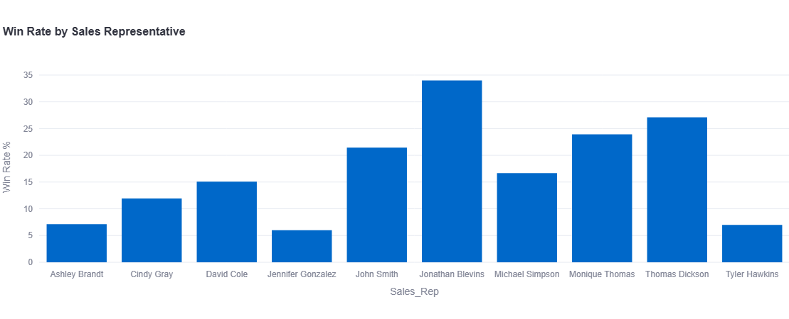

# Sales Pipeline Analysis Dashboard

A Streamlit-based dashboard for analyzing sales pipeline data with interactive visualizations and filters.

## Features

- **Interactive Filtering**: Filter data by Region and Product
- **Pipeline Conversion Analysis**:
  - Funnel chart showing stage-wise progression
  - Detailed conversion rates between stages
- **Deal Size Analysis**:
  - Average deal size by product
  - Average deal size by region
  - Average deal size by sales representative
- **Sales Performance Metrics**:
  - Win rates per sales representative
  - Total deals and revenue metrics
  - Performance visualization
- **Revenue Analysis**:
  - Product revenue distribution
  - Monthly revenue trends

## Setup Instructions

1. Clone this repository:

```bash
git clone [repository-url]
cd Sales_analysis
```

2. Create a virtual environment and activate it:

```bash
python -m venv .venv
# On Windows
.venv\Scripts\activate
# On macOS/Linux
source .venv/bin/activate
```

3. Install required packages:

```bash
pip install -r requirements.txt
```

4. Run the Streamlit app:

```bash
streamlit run app.py
```

## Deployment

### Local Deployment

1. Ensure you have Python 3.8 or later installed
2. Follow the setup instructions above
3. Access the app at `http://localhost:8501`

## Data Structure

The dashboard expects a CSV file (`sales_pipeline_data.csv`) with the following columns:

- Lead_ID
- Sales_Rep
- Region
- Product
- Stage
- Stage_Entry_Date
- Deal_Amount
- Outcome
- Close_Date

## Screenshots

### Pipeline Conversion Analysis


### Deal Size Analysis


### Sales Performance




### Revenue Analysis


## Usage Tips

1. Use the sidebar filters to focus on specific regions or products
2. The funnel chart shows the progression of deals through different stages
3. Hover over charts for detailed information
4. All visualizations are interactive and respond to the filters
5. Tables can be sorted by clicking on column headers

## Contributing

Feel free to submit issues and enhancement requests!

## License

This project is for educational and internal use. Modify and extend as needed.
